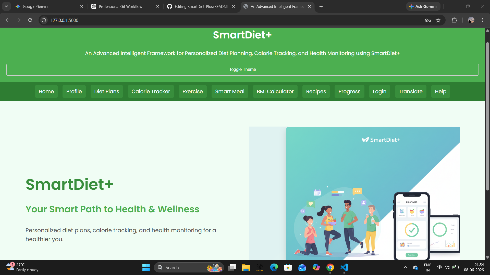
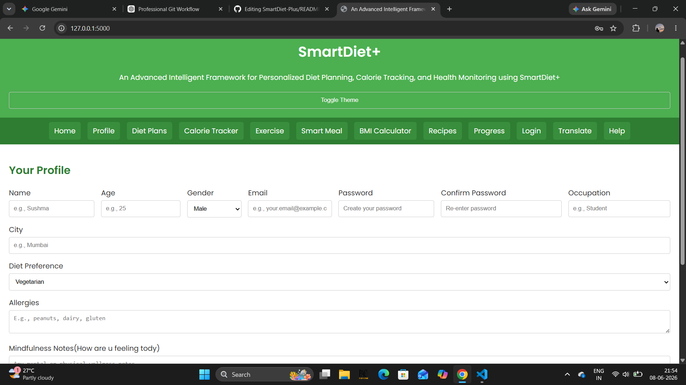

# SmartDiet+ 🥗

## Overview

SmartDiet+ is an AI-powered diet and calorie tracking platform built using Flask, MySQL, HTML, CSS, and JavaScript. It helps users maintain healthy eating habits through personalized meal recommendations, calorie tracking, recipe suggestions, progress monitoring, and reminder management.

---

## Features

* Personalized diet recommendations
* Daily calorie tracking and food logging
* Healthy recipe suggestions
* Progress monitoring dashboard
* Reminder management system
* User profile management
* MySQL database integration
* Responsive user interface

---

## Tech Stack

### Frontend

* HTML5
* CSS3
* JavaScript

### Backend

* Python
* Flask

### Database

* MySQL

### Tools

* Git
* GitHub
* VS Code

---

## Installation

### Clone the repository

```bash
git clone https://github.com/snehagada31/SmartDiet-Plus.git
```

### Install dependencies

```bash
pip install -r requirements.txt
```

### Run the application

```bash
python app.py
```

---

## Screenshots

### Home Page



---

### User Profile Page



---

### Recipe Recommendation Page


---


## Workflow

User Input → Flask Backend → Recommendation Engine → MySQL Database → Personalized Recommendations

---

## Future Enhancements

* Food image recognition using AI
* Nutrition chatbot assistant
* Weekly health analytics dashboard
* Mobile application support
* Wearable device integration

---

## Skills Demonstrated

* Full Stack Web Development
* Flask Framework
* Database Management
* User Authentication
* Frontend Development
* Git and GitHub Version Control

---

## Author

**Sneha Gada**

GitHub: https://github.com/snehagada31

